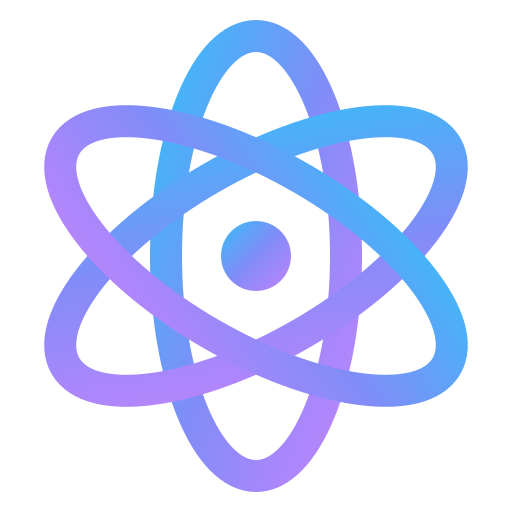

<p align="center">
  
</p>

# styled-cva Documentation

This directory contains the Nextra documentation site for styled-cva.

## Development

To start the development server:

```bash
bun dev
# or from repo root
bun run --filter @styled-cva/docs dev
```

Open [http://localhost:3000](http://localhost:3000) in your browser.

## Build

To build the documentation site:

```bash
bun build
# or from repo root
bun run --filter @styled-cva/docs build
```

## Start Production Server

To start the production server:

```bash
bun start
# or from repo root
bun run --filter @styled-cva/docs start
```

## Project Structure

- `app/` - Next.js app directory with MDX pages
- `public/` - Static assets (images, icons, etc.)
- `next.config.mjs` - Next.js and Nextra configuration
- `theme.config.tsx` - Nextra theme configuration
- `mdx-components.jsx` - Custom MDX components

## Adding New Pages

Create new `.mdx` files in the `app/` directory. The file structure determines the URL:

- `app/page.mdx` → `/`
- `app/getting-started/page.mdx` → `/getting-started`
- `app/api/page.mdx` → `/api`

Update `app/_meta.js` to control the sidebar navigation order and titles.

## MCP Docs Server

This documentation site also functions as an HTTP MCP (Model Context Protocol) docs server, making the documentation accessible to AI assistants and other MCP clients.

### Endpoint

The MCP server is available at:

- **Production**: `https://styled-cva.vercel.app/api/mcp`
- **Development**: `http://localhost:3000/api/mcp`

### Available Resources

The server exposes the following documentation pages as MCP resources:

- `styled-cva://docs/introduction` - Introduction page
- `styled-cva://docs/getting-started` - Getting Started guide
- `styled-cva://docs/api` - API Reference

### Available Tools

- `list_docs` - List all available documentation pages
- `search_docs` - Search documentation by keyword (requires `query` parameter)

### Usage Example

You can connect to this MCP server from any MCP client. For example, using the MCP SDK:

```typescript
import { Client } from "@modelcontextprotocol/sdk/client/index.js";
import { StreamableHTTPClientTransport } from "@modelcontextprotocol/sdk/client/streamableHttp.js";

const client = new Client({
  name: "styled-cva-docs-client",
  version: "1.0.0",
});

const transport = new StreamableHTTPClientTransport(
  new URL("https://styled-cva.vercel.app/api/mcp")
  // Or use 'http://localhost:3000/api/mcp' for local development
);

await client.connect(transport);

// List resources
const resources = await client.listResources();
console.log(resources);

// Read a resource
const content = await client.readResource({
  uri: "styled-cva://docs/introduction",
});
console.log(content);

// List tools
const tools = await client.listTools();
console.log(tools);

// Call a tool
const result = await client.callTool({
  name: "search_docs",
  arguments: { query: "button" },
});
console.log(result);
```

### Adding New Pages to MCP

When you add a new documentation page, update the `DOCS_PAGES` array in `lib/mcp-server.ts` to include it in the MCP server:

```typescript
export const DOCS_PAGES = [
  // ... existing pages
  {
    path: "new-page/page.mdx",
    route: "/new-page",
    title: "New Page",
    resource: "styled-cva://docs/new-page",
  },
];
```
